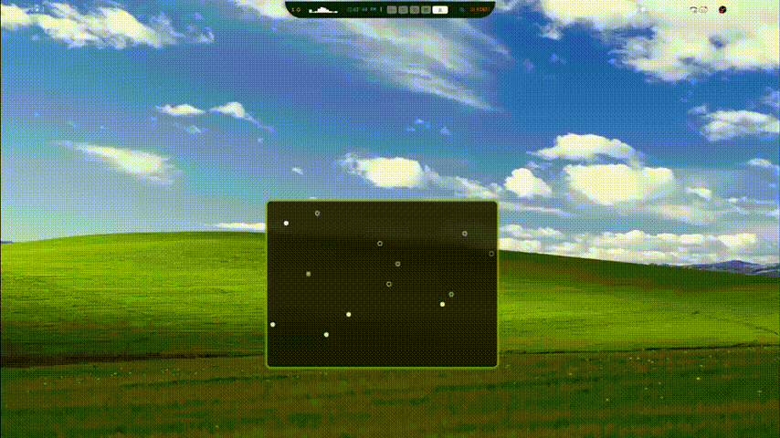
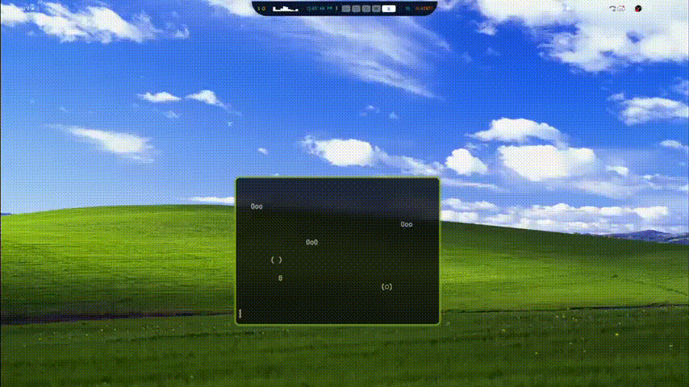

# 🫧 BUBBLESCLI 🫧

A frutiger aero inspired terminal bubble generator for Linux

## Table of Contents

- [Installation](#installation)
- [demo](#demo)
- [configuration](#configuration)
- [Uninstall](uninstall)

## Installation

First, clone the repo
```bash
git clone https://github.com/MingcheL1/BubblesCLI.git
```

Then, install it
```bash
cd bubblescli
make
sudo make install
```

## Demo

Default Mode:


bubblescli -b:


bubblescli --no-color:

# Configuration

All configurations are located in ~/.config/bubblescli/config.ini

## Uninstall

To uninstall
```bash
cd bubblescli
sudo make uninstall
```
